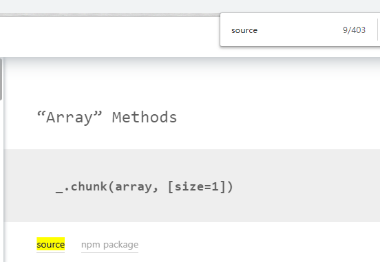

# 每天学点 Lodash

> 是一个一致性、模块化、高性能的 JavaScript 实用工具库。

一直以来对 lodash 的使用都挺随缘的，文档也没有全部过过一遍，只是想着——嗯，这个功能挺常见的，应该有吧——的心态去用的。

+ [官网](https://lodash.com)
+ [中文](https://www.lodashjs.com)

按文档的划分，目前(4.17.x) lodash 分为十三个部分，403 个方法：

+ [ ] Array 数组
+ [ ] Collection
+ [ ] Date
+ [ ] Function
+ [ ] Lang
+ [ ] Math
+ [ ] Number
+ [ ] Object
+ [ ] Seq
+ [ ] String
+ [ ] Util
+ [ ] Properties
+ [ ] Methods

原则上每个部分的学习笔记按照学习日期划分，但文档在每个部分中的方法按照字典序排列，可能出现相关的函数不临近的情况，在这种情况下会写入之前的部分。
